<div align="center">


# Antaaya Villas CRM

### A complete real-estate sales & post-sales management system — from the first website enquiry to the day the keys are handed over.

Built from scratch and running in production for **Antaaya Villas, Lonavala** (Akruti Developer Ltd.)

<br/>


<br/>

| 🧩 **33** pipeline stages | 👥 **5** roles · 6 desks | 🔌 **28** API endpoints | 🗄️ **14** DB tables | 🧱 **34** schema migrations | 📝 **~15.7k** lines of code |
|:---:|:---:|:---:|:---:|:---:|:---:|

</div>

---

## 📑 Table of Contents

- [Overview](#-overview)
- [Screenshots](#-screenshots)
- [Lead Lifecycle](#-lead-lifecycle)
- [Key Features](#-key-features)
- [Roles & Permissions](#-roles--permissions)
- [Construction-Linked Payment Schedule](#-construction-linked-payment-schedule)
- [Architecture](#-architecture)
- [Database Design](#-database-design)
- [Security & Data Protection](#-security--data-protection)
- [Tech Stack](#-tech-stack)
- [Project Structure](#-project-structure)
- [Getting Started](#-getting-started)
- [Development Journey](#-development-journey)
- [Author](#-author)

---

## 🏡 Overview

Antaaya Villas is a luxury villa project in Lonavala. Before this CRM, leads arrived through several website forms, were tracked in spreadsheets, and the hand-off from the sales team to the legal and accounts teams happened over phone calls and WhatsApp.

**This CRM puts the entire customer journey in one system:**

- 🌐 **Every website enquiry** lands in a review queue — nothing is lost, nothing is auto-assigned without a human check
- 💼 **Sales** moves each lead through a guided, checkpoint-based pipeline — calls, site visits, follow-ups, negotiation, unit selection
- 📄 **Legal** handles booking, KYC and agreement registration, with mandatory documents gating each step
- 💰 **Accounts** raises construction-linked payment demands, sends A4 PDF demand letters by email & WhatsApp, and logs every payment
- 🔑 **Admin** oversees everything, manages possession and handover, and has a permanent audit log of every hand-off

It started as a single-file HTML prototype using `localStorage` and grew — through close day-to-day feedback from the sales, legal and accounts teams — into a multi-user PHP + MySQL application with role-based access, live inventory sync, document management and PDF generation.

---

## 📸 Screenshots

> All screenshots use demo data — no real customer information is shown.

<div align="center">

### Dashboard
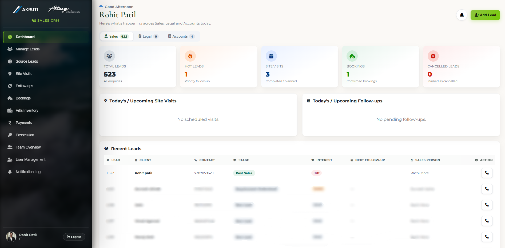

### Lead Pipeline — Edit Client
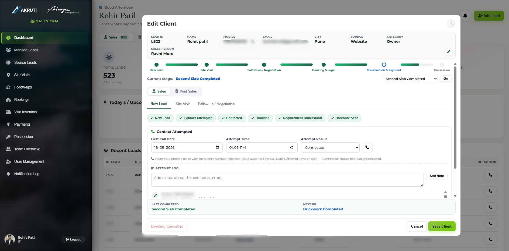

### Walkthrough
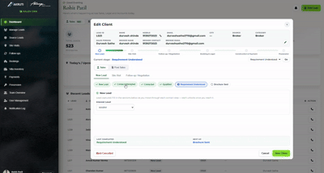

</div>

<table>
  <tr>
    <td width="50%" align="center"><b>Manage Leads</b><br/>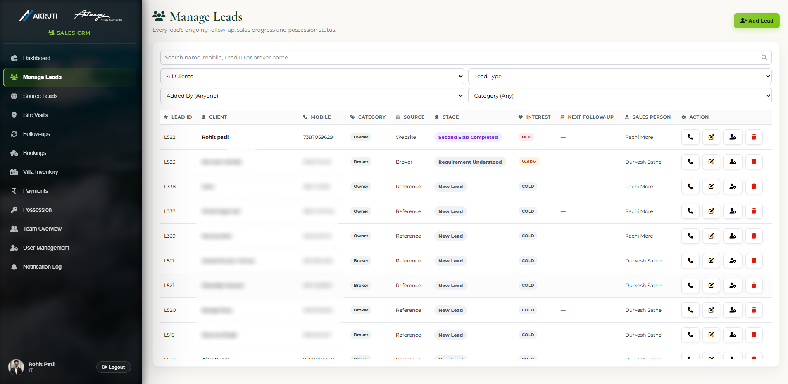</td>
    <td width="50%" align="center"><b>Lead Summary & History</b><br/>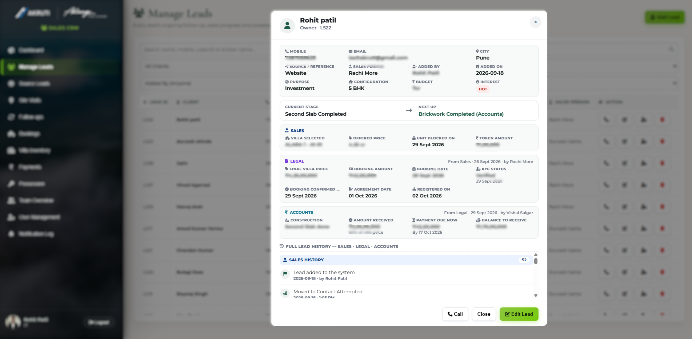</td>
  </tr>
  <tr>
    <td align="center"><b>Source Leads Review</b><br/>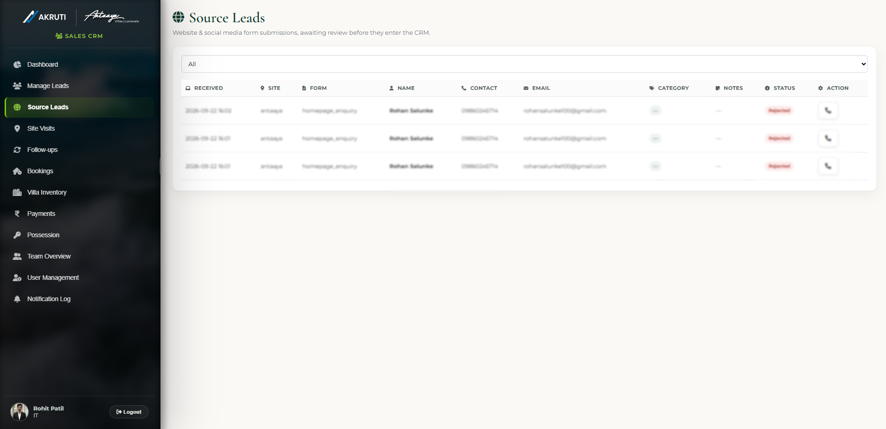</td>
    <td align="center"><b>Villa Inventory</b><br/>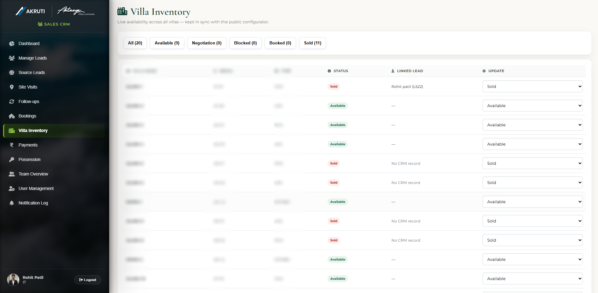</td>
  </tr>
  <tr>
    <td align="center"><b>Booking & Legal (KYC)</b><br/>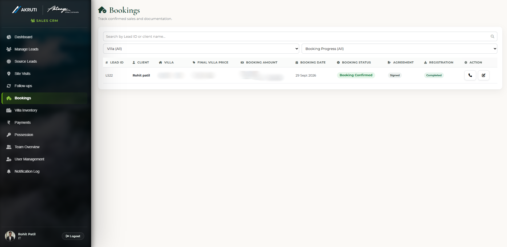</td>
    <td align="center"><b>Construction & Payment</b><br/>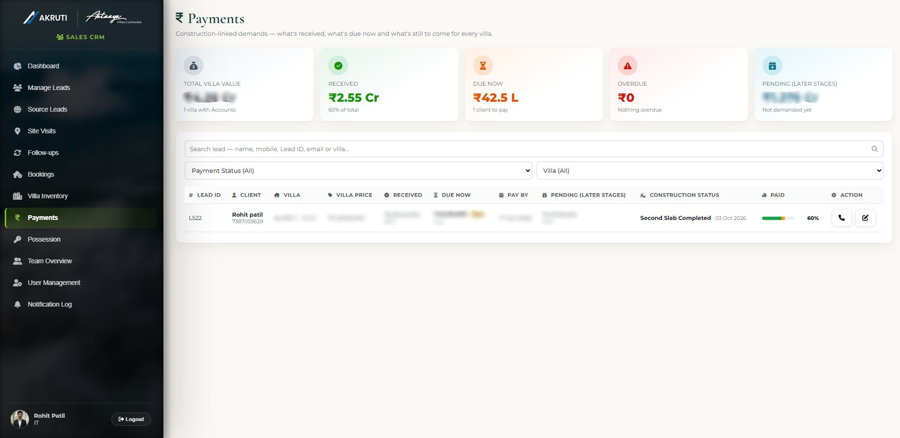</td>
  </tr>
  <tr>
    <td align="center"><b>A4 Demand Letter (PDF)</b><br/>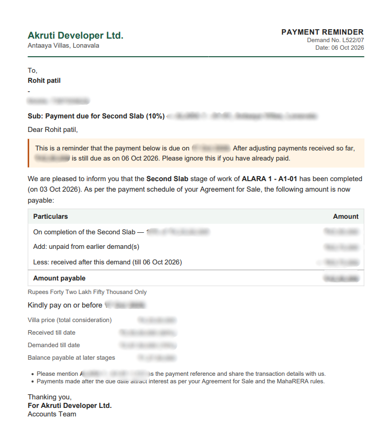</td>
    <td align="center"><b>Notification Log</b><br/>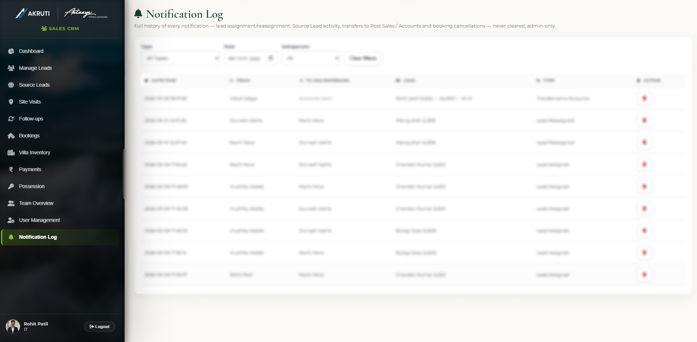</td>
  </tr>
</table>

<div align="center">

### Mobile — app-like layout
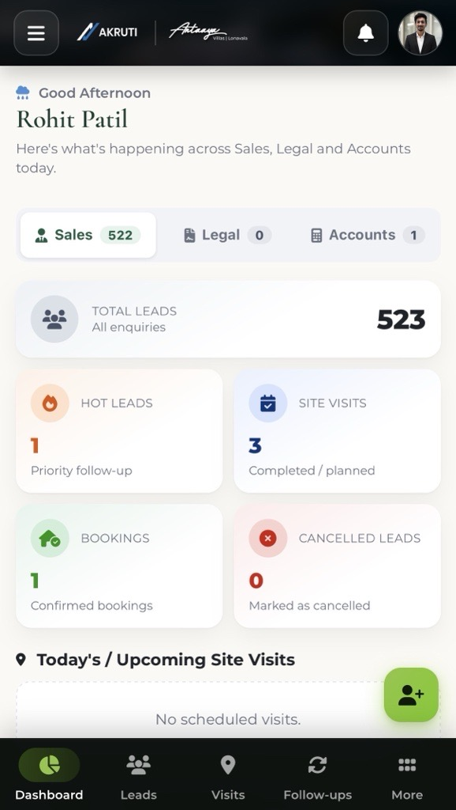&nbsp;&nbsp;
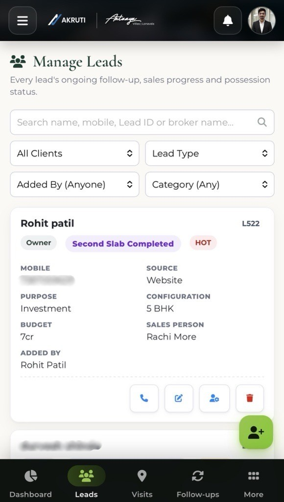&nbsp;&nbsp;
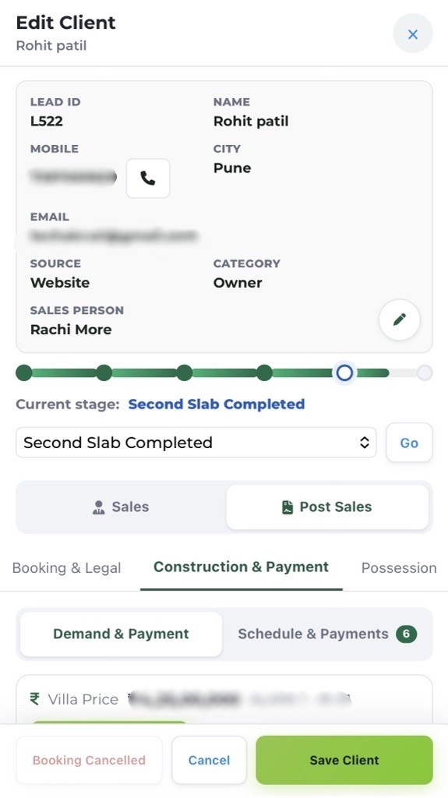

</div>

---

## 🔄 Lead Lifecycle

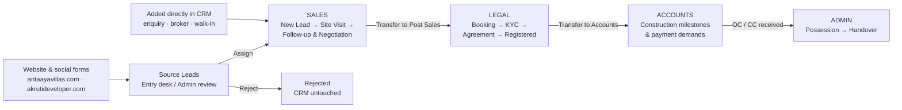

### The 33-stage pipeline

| Group | Stages | Owner |
|---|---|---|
| 🆕 **New Lead** | New Lead · Contact Attempted · Contacted · Qualified · Requirement Understood · Brochure Sent | Sales |
| 🏞️ **Site Visit** | Site Visit Scheduled · Site Visit Follow-up · Site Visit Completed | Sales |
| 🤝 **Follow-up / Negotiation** | Post Site Visit Follow-up · Re-Visit Scheduled · Re-Visit Follow-up · Re-Visit Completed · Negotiation Visit Scheduled · Negotiation Visit Follow-up · Unit Selection · Villa Blocked Follow-up · Unit Blocked | Sales |
| 📄 **Booking & Legal** | Booking Initiated · KYC Verification · Booking Confirmed · Agreement In Process · Registered | Legal |
| 🏗️ **Construction & Payment** | Construction Customer · Plinth · First Slab · Second Slab · Brickwork · Plaster & Flooring · Fittings | Accounts |
| 🔑 **Possession** | Possession Due · Possession Offered · Handover Completed | Admin |
| ⛔ **Terminal** | Closed · Cancelled | — |

Each stage is a **checkpoint**: locked until the previous one is complete, with its own fields, mandatory documents, and history entries. Admins can correct a lead backwards with a "Go to stage" control; forward movement is always earned.

---

## ✨ Key Features

<details open>
<summary><b>🌐 Lead Capture & Routing</b></summary>

- Four public website forms (enquiry, broker, site-visit, brochure download) on two different domains post to one intake endpoint
- A **flexible alias map** matches each form's own field names onto CRM columns — unknown fields are kept as raw JSON for audit, never forced into the wrong column
- Submissions wait in **Source Leads** until a human reviews them → **Assign** (creates a real lead with a Lead ID) or **Reject**
- **Duplicate detection** by mobile number; existing leads are never silently reassigned
- **Desk-based auto-routing** (Broker desk / Owner desk / Entry desk) with manual reassignment and a lead-transfer request flow between desks

</details>

<details>
<summary><b>💼 Sales Pipeline</b></summary>

- **Edit Client** modal with a liquid progress bar, per-group checkpoint chips (locked / current / done) and one section per tab
- Basic details save inline without closing the modal
- **Lead Summary** popup — the full story of a lead at a glance: current stage, next step, pending visits and follow-ups, history
- **Lead History** — every stage change, call, email, WhatsApp, document upload and reassignment is logged with who and when
- **One-tap call button** (`tel:` link) everywhere a phone number appears; every call is logged to the lead
- Leads by Category, team overview cards with profile photos, and a live weather greeting for Lonavala

</details>

<details>
<summary><b>🏞️ Site Visits & Follow-ups</b></summary>

- Three visit types — **Site Visit, Re-Visit, Negotiation Visit** — each with Scheduled → Completed / Follow-up checkpoints
- **Calendar invites (.ics) sent from the salesperson's own Gmail** via PHPMailer — the invite updates the same event on reschedule
- **"Client proposed new time"** — one click resends the invite as a reschedule and notifies every admin
- WhatsApp visit confirmation with the site location
- Follow-ups auto-detect their type from the lead's stage; "Complete" or "Done, re-follow pending" (spawns the next one)
- Site Visits and Follow-ups pages with search + type / status / date filters

</details>

<details>
<summary><b>🏘️ Villa Inventory — synced live from the pipeline</b></summary>

- Status flow: **Available → Negotiation → Blocked → Booked → Sold**
- A lead's stage drives its villa's status automatically (Unit Selection → Negotiation, Unit Blocked → Blocked, Booking Confirmed → Booked, Registered → Sold)
- **Conflict checks** stop two leads holding the same villa; villas are released on cancel, stage-back or villa change
- Type-or-select villa picker with multi-select shortlist chips and status pills, sorted by serial in natural order

</details>

<details>
<summary><b>📄 Booking & Legal</b></summary>

- KYC rules by applicant type — **Resident Individual, NRI, Company / LLP / Firm, HUF** — plus co-applicant documents
- **Mandatory documents gate the pipeline**: booking form & receipt, stamp duty & registration fee receipts, registered agreement & Index II
- Secure upload / download of every document per lead
- Once **Registered**, the buyer is final — the booking can no longer be cancelled
- One-click **Transfer to Accounts**; the lead becomes read-only for Legal

</details>

<details>
<summary><b>💰 Accounts — Construction-Linked Payments</b></summary>

- Payment schedule generated automatically from the Final Villa Price ([see table below](#-construction-linked-payment-schedule))
- **One action — "Update & Raise Demand"** — moves the construction stage *and* raises that instalment's demand
- **Unpaid balances carry forward** into the next demand automatically; payments apply to the oldest balance first
- **A4 demand letter & payment receipt PDFs** generated server-side (Dompdf)
- Demand sent by **email (PDF attached)** or **WhatsApp (secure 32-character private link to the PDF)**, switching to "Reminder" once sent or overdue
- 100% progress bar — Received · Due now · Pending — and a **Demand Log** of every letter, email, WhatsApp and call
- Construction documents (architect certificate, site photos, signed demand letter) kept per stage; earlier stages always accessible
- **Handover stays locked** until the villa price is fully received

</details>

<details>
<summary><b>🔔 Notifications & Audit</b></summary>

- Notification bell per user: lead assignments, transfer requests, new source leads, due follow-ups, newly scheduled visits, post-sales transfers
- **Admin Notification Log** — a permanent, never-cleared audit trail of every assignment, reassignment, source-lead decision, desk transfer and reschedule request, filterable by date, salesperson and type

</details>

<details>
<summary><b>📱 Fully Responsive</b></summary>

- **Laptops**: the same desktop UI, scaled — no overflow or clipped content at any width
- **Tablets**: tables and detail panels re-flow where they don't fit
- **Phones**: an app-like layout with a floating Add button, compact filters and touch-sized controls — every feature still available
- Same visual theme on every device; all responsive rules live in a separate `responsive.css` / `responsive.js`
- Smart WhatsApp hand-off on PC — opens the desktop app if installed, otherwise WhatsApp Web, and remembers the choice

</details>

---

## 👥 Roles & Permissions

| Role / Desk | Sees | Can do |
|---|---|---|
| 🛠️ **IT** | Everything | Full admin access + IT-only controls |
| 👑 **Admin** | Everything — Sales and Post Sales | Edit any lead, reassign, correct stages, manage users, possession & handover, Notification Log |
| 🧾 **Sales — Entry desk** | Leads they created + Source Leads | Review & assign website leads, add leads |
| 🤝 **Sales — Broker desk** | Their own broker leads | Full Sales pipeline, visits, follow-ups, villa inventory |
| 🏠 **Sales — Owner desk** | Their own direct / investor leads | Full Sales pipeline, visits, follow-ups, villa inventory |
| ⚖️ **Legal** | Leads transferred by Sales | Booking & Legal only → transfer to Accounts |
| 💳 **Accounts** | Leads transferred by Legal | Construction & Payment only; Possession read-only |

Every rule is enforced **on the server** (`api/auth.php` + per-endpoint checks), not just hidden in the UI.

---

## 🏗️ Construction-Linked Payment Schedule

Demands are raised strictly on the Final Villa Price, split across construction milestones:

| # | Milestone | % | Collected by |
|:-:|---|:-:|---|
| 1 | Booking amount | **10%** | Legal |
| 2 | Execution of Agreement for Sale | **20%** | Accounts |
| 3 | Plinth completed | **15%** | Accounts |
| 4 | First slab completed | **15%** | Accounts |
| 5 | Second slab completed | **10%** | Accounts |
| 6 | Brickwork completed | **10%** | Accounts |
| 7 | Plaster, flooring & plumbing | **10%** | Accounts |
| 8 | Doors, windows & fittings | **5%** | Accounts |
| 9 | Possession (on OC / CC) | **5%** | Accounts |
| | **Total** | **100%** | |

---

## 🧭 Architecture

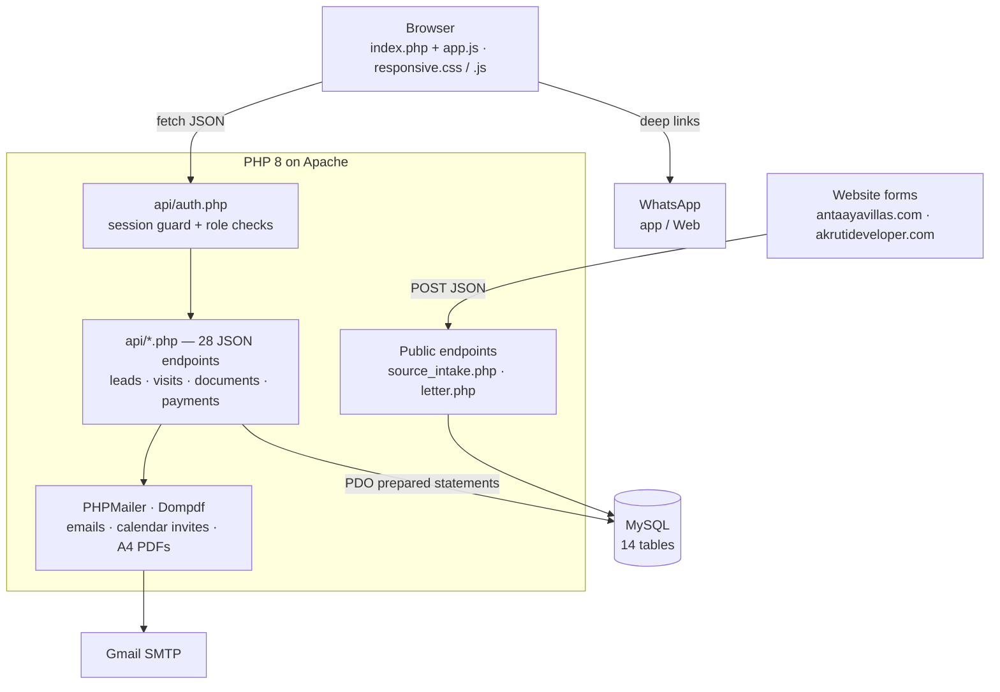

- **Front end** — one PHP-rendered shell (`index.php`) with page sections switched client-side by `app.js`; every data operation is a `fetch()` call to a JSON endpoint
- **Back end** — small, focused PHP endpoints (`clients.php`, `payments.php`, `visit_invite.php`, …) with shared business-logic libraries (`payment_lib.php`, `legal_docs_lib.php`, `sv_followup_lib.php`)
- **No framework, no build step** — deploys to standard shared hosting by uploading the folder

---

## 🗄️ Database Design

| Table | Purpose |
|---|---|
| `users` | Logins, role, desk, profile photo, encrypted SMTP App Password |
| `clients` | The lead / customer record — every pipeline field across all stages |
| `source_leads` | Raw website & social submissions awaiting review |
| `followups` | Follow-up tasks linked to pipeline stages |
| `visits` | Completed site / re-visit / negotiation visits |
| `villas` | Villa inventory and live status |
| `client_documents` | Uploaded KYC, legal and construction documents |
| `payment_plans` · `payment_schedule` | Each lead's instalment plan |
| `payment_demands` | Demands raised per construction stage |
| `client_payments` | Payments received (mode, UTR / cheque, proof) |
| `assignment_log` | Permanent audit log — assignments, transfers, source-lead decisions |
| `lead_transfer_requests` | Cross-desk lead transfer requests |
| `notification_clears` | Per-user notification read state |

The schema evolved through **34 versioned migrations** (`database/migrations/`), each applied safely to the live database without data loss. `database/schema.sql` is the complete current schema for a fresh install.

---

## 🔐 Security & Data Protection

- **Passwords** hashed with PHP `password_hash()` / `password_verify()`
- **Session-guarded API** — every protected endpoint requires a valid login; responses are sent with `no-store` cache headers so one user's data is never replayed to another
- **Server-side authorization** for every role rule (a salesperson can't edit a lead once it's with Post Sales; Legal / Accounts can't add leads; and so on)
- **SQL injection protection** — all queries use PDO prepared statements
- **Output escaping** (`esc()`) on user-supplied values rendered into the page
- **Salespeople's Gmail App Passwords stored encrypted** (AES-256-CBC) in the database
- **Uploaded documents are never served directly** — `uploads/` is closed by `.htaccess`; files are only reachable through an authenticated endpoint
- **WhatsApp letter links** use an unguessable 32-character token, are `noindex`, and are deleted with the lead
- **This public repository** contains no credentials and no customer data — real config lives in gitignored files (see below)

---

## 🛠️ Tech Stack

| Layer | Technology |
|---|---|
| **Front end** | HTML5, CSS3, vanilla JavaScript (ES6), Font Awesome, Google Fonts (Montserrat, Cormorant Garamond) |
| **Back end** | PHP 8 (no framework), PDO |
| **Database** | MySQL / MariaDB |
| **Email** | PHPMailer over Gmail SMTP — calendar invites (.ics), demand letters |
| **PDF** | Dompdf — A4 demand letters & payment receipts |
| **Integrations** | WhatsApp deep links, Open-Meteo weather API, Google Maps links |
| **Hosting** | Apache shared hosting (cPanel / phpMyAdmin) |
| **Local dev** | XAMPP |

---

## 📁 Project Structure

```
antaaya-villas-crm/
├── index.php                 # Main app shell — all pages and modals
├── login.php                 # Login screen
├── letter.php                # Public token link to a demand-letter PDF (sent on WhatsApp)
│
├── api/                      # 28 JSON endpoints
│   ├── auth.php              #   session guard + role helpers
│   ├── clients.php           #   lead CRUD, stage rules, villa sync
│   ├── source_intake.php     #   PUBLIC — website form intake
│   ├── source_leads.php      #   review queue: assign / reject
│   ├── visit_invite.php      #   calendar invites via PHPMailer
│   ├── payments.php          #   demands, receipts, PDFs, email / WhatsApp
│   ├── payment_lib.php       #   payment schedule logic
│   ├── legal_docs_lib.php    #   KYC & document rules per stage
│   ├── client_documents.php  #   secure upload / download
│   ├── assignment_log.php    #   notifications + audit log
│   └── …
│
├── assets/
│   ├── js/app.js             # Front-end application
│   ├── js/responsive.js      # Phone / tablet behaviour
│   └── css/responsive.css    # Responsive layouts
│
├── config/
│   ├── db.example.php        # → copy to db.php   (gitignored)
│   ├── mail.example.php      # → copy to mail.php (gitignored)
│   └── site.php              # Company / project details for letters
│
├── database/
│   ├── schema.sql            # Full schema for a fresh install
│   └── migrations/           # 34 versioned migrations (v3 → v37)
│
├── lib/                      # PHPMailer, Dompdf (bundled — no Composer needed)
├── uploads/                  # Runtime document storage (closed to the web, gitignored)
├── image/                    # Logos
└── docs/CHANGELOG.md         # Full development log
```

---

## 🚀 Getting Started

**Requirements:** PHP 8+, MySQL / MariaDB, Apache (XAMPP works for local use).

**1. Clone the repo**
```bash
git clone https://github.com/Rohit55-Code/antaaya-villas-crm.git
```
Place the folder in your web root (e.g. `C:\xampp\htdocs\crm`).

**2. Create the database**
Create an empty database in phpMyAdmin, then import `database/schema.sql`.

**3. Add your config**
```bash
cp config/db.example.php   config/db.php
cp config/mail.example.php config/mail.php
```
Fill in your database credentials in `config/db.php` and set a long random `MAIL_SECRET` in `config/mail.php`. Company details for letters go in `config/site.php`.

**4. Create the first admin login**
```bash
php -r "echo password_hash('YourStrongPassword', PASSWORD_DEFAULT);"
```
```sql
INSERT INTO users (name, email, password_hash, role)
VALUES ('Admin', 'admin@example.com', '<paste-the-hash-here>', 'admin');
```

**5. Open the app**
Go to `http://localhost/crm/login.php` and sign in. Add the rest of the team from **User Management**.

---

## 📈 Development Journey

This CRM was built iteratively, version by version, working directly with the sales, legal and accounts teams who use it every day.

| Phase | What was added |
|---|---|
| **Prototype** | Single HTML file with `localStorage` — proved the workflow |
| **v2 – v10** | PHP + MySQL rewrite, multi-user logins, desk routing, website form intake |
| **v10 – v50** | Source Leads review queue, follow-ups, site visits, notification bell, dashboard redesign |
| **v50 – v90** | Checkpoint-based pipeline, visit types, calendar invites, live villa inventory sync |
| **v90 – v100** | Permanent audit log, reschedule flow, Sales / Post Sales split |
| **Final** | Legal and Accounts desks, KYC & document gating, construction-linked payment demands, A4 PDFs, email & WhatsApp delivery, full responsive redesign |

The complete build log is in **[docs/CHANGELOG.md](docs/CHANGELOG.md)**.

---

## 👨‍💻 Author

<div align="center">

**Rohit Patil**
Full Stack Developer · Akruti Developer Ltd.

[](https://github.com/Rohit55-Code)

<sub>Shared for portfolio purposes. All credentials and customer data have been removed. © Akruti Developer Ltd.</sub>

</div>
